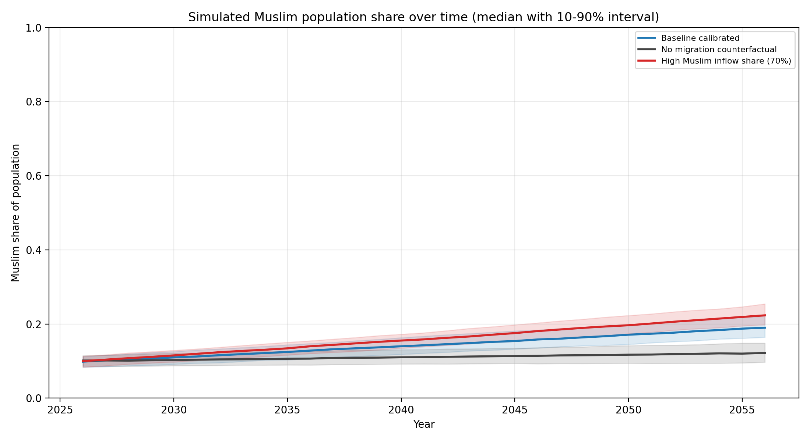
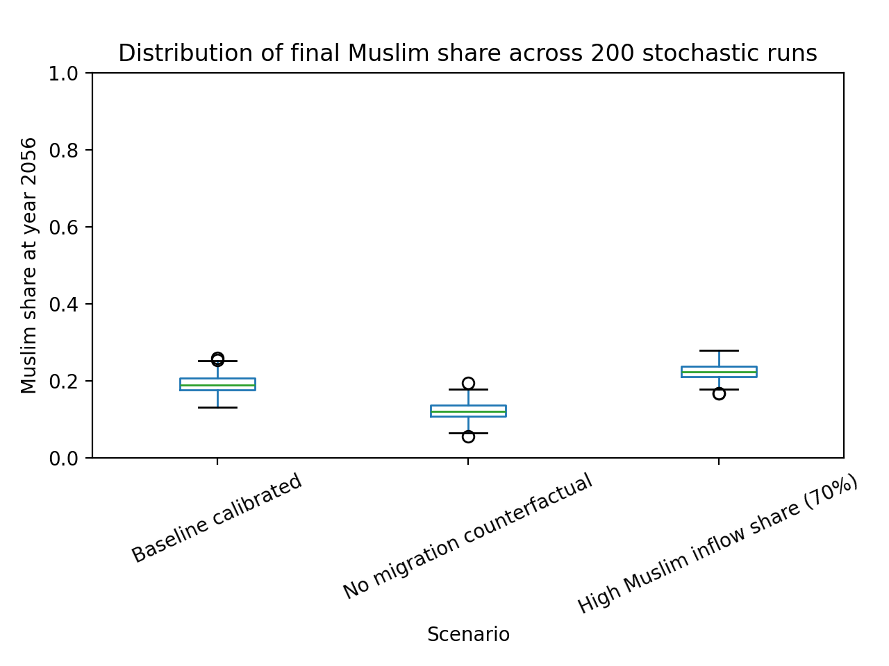
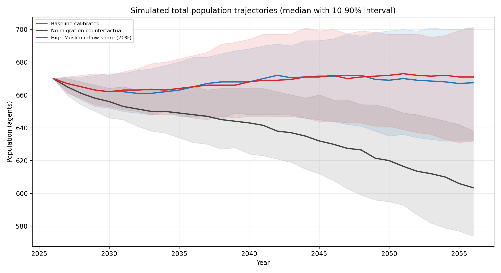

---
layout: default
title: France Religious Composition ABM (30-Year Outlook + Majority Threshold)
---

# France Religious Composition ABM: 30-Year Outlook and Majority Threshold

**Article type:** Simulation study  
**Date:** 2026  
**Author:** [Nicolas Len](https://www.linkedin.com/in/niclen/)  
**Keywords:** netlogo, agent-based-model, demography, simulation, religious-breakdown

## Abstract
This study uses a calibrated NetLogo agent-based model to examine changes in religious composition in France. Under the revised baseline (`share-muslim-incoming = 0.52`, `muslim-birth-rate = 2.81`, `agents-coming = 3.36`, `agents-leaving = 1.66`), the 30-year baseline run (2026-2056) rises from about 10% to about 19.2% Muslim share (P10-P90: 16.4%-22.0%). In a separate longer threshold run (same baseline assumptions, 200 years, 400 repetitions), the first year where at least half of runs are above 50% is 2128 (about 102 years after 2026).

## Key Claims

- In 30 years, baseline Muslim share reaches about 20% (from about 10%).
- Under the same assumptions, majority (>50%) appears around 2128 (about 100 years).

## 1. Research Question
How does Muslim population share change over 30 years under a revised baseline calibrated to migration-origin composition and a fixed fertility proxy for majority-Muslim origin countries, and when does the same baseline cross the majority threshold in longer runs?

## 2. Data and Baseline Calibration
Calibration details are in `calibration_notes.md`.

### 2.1 Primary data sources

- INSEE Premiere No. 2087 (published January 13, 2026): aggregate demography for France (population, births, deaths, net migration, TFR).
- INSEE 2023 immigrant entries by country of birth: migration-origin composition.
- INSEE detailed tables in `data/insee_2025/`: age structure, fertility profile, mortality profile.
- INSEE/INED TeO2 (2019-2020): religion-identification survey used for the initial-share proxy.
- Pew Research Center `Religious Composition 2010-2020`: country-level Muslim shares for origin mapping.
- World Bank indicator `SP.DYN.TFRT.IN`: country-level TFR values used for fertility proxy.

### 2.2 Source files in this repository

- `data/incoming_origin_religion_mapping_2023.csv`
- `data/incoming_origin_religion_summary_2023.json`
- `data/muslim_country_fertility_proxy.csv`
- `data/muslim_country_fertility_proxy_summary.json`
- `calibration_notes.md`

Revised baseline values:

- `share-muslim-incoming = 0.52`
- `muslim-birth-rate = 2.81`
- `non-muslim-birth-rate = 1.56`
- `agents-coming = 3.36`
- `agents-leaving = 1.66`
- `coverage-coefficient = 1.00`

Construction notes:

- `share-muslim-incoming = 0.52` is the known-country weighted value from `data/incoming_origin_religion_mapping_2023.csv`.
- `muslim-birth-rate = 2.81` is a weighted TFR proxy from majority-Muslim origin countries in the 2023 entrant list (see `data/muslim_country_fertility_proxy.csv` and `data/muslim_country_fertility_proxy_summary.json`).
- `agents-coming = 3.36` and `agents-leaving = 1.66` are scaled from entrant and implied outflow counts under 670-agent representation.

### 2.3 Included numeric anchors and derived inputs

- Population scale anchor: about 69.1 million represented by 670 agents.
- INSEE aggregate anchors (2025): births about 645,000; deaths about 651,000; net migration about +176,000; TFR about 1.56.
- Entrant total in mapping year (2023): 346,900.
- Covered listed-country arrivals: 250,300 (72.15% coverage).
- Weighted Muslim share on covered origins: 52.15% (baseline uses `share-muslim-incoming = 0.52`).
- Residual-adjusted alternative share: 47.33% (sensitivity reference).
- Majority-Muslim origin-country fertility proxy: 2.8057 (rounded to `muslim-birth-rate = 2.81`).
- Baseline migration rates used in model: `agents-coming = 3.36`, `agents-leaving = 1.66`.
- Initial Muslim share at setup: 0.10, taken from TeO2 estimate (about 10% among ages 18-59).

## 3. Model Structure
Each tick is one year. Each tick applies:

1. Aging.
2. Age- and sex-specific mortality.
3. Out-migration (ages 18-64).
4. Births (female ages 15-49).
5. In-migration with religion assignment controlled by `share-muslim-incoming`.

Fractional migration rates are implemented stochastically, so non-integer rates (for example 3.36 and 1.66) are respected in long-run average.

## 4. Experimental Design

### 4.1 30-year comparison set
Three scenarios, 200 repetitions each, 30 years per repetition:

| Scenario | share-muslim-incoming | muslim-birth-rate | non-muslim-birth-rate | agents-coming | agents-leaving |
|---|---:|---:|---:|---:|---:|
| Baseline calibrated | 0.52 | 2.81 | 1.56 | 3.36 | 1.66 |
| No migration counterfactual | 0.52 | 2.81 | 1.56 | 0.00 | 0.00 |
| High Muslim inflow share | 0.70 | 2.81 | 1.56 | 3.36 | 1.66 |

30-year outputs:

- `data/paper_runs/final_summary_30y.csv`
- `data/paper_runs/key_points_30y.csv`

### 4.2 Majority-threshold run
One baseline experiment, 400 repetitions, 200 years, tracking first crossing of 50%.

Threshold outputs:

- `data/paper_runs/baseline_first_crossing_50pct_200y.csv`
- `data/paper_runs/baseline_crossing_summary_200y.json`
- `data/paper_runs/baseline_crossing_share_by_horizon.csv`

## 5. Results

### 5.1 30-year outcomes (2056)
Values from `data/paper_runs/final_summary_30y.csv`.

| Scenario | Mean Muslim share | P10 | P90 |
|---|---:|---:|---:|
| Baseline calibrated | 19.2% | 16.4% | 22.0% |
| No migration counterfactual | 12.3% | 9.7% | 14.9% |
| High Muslim inflow share | 22.5% | 20.0% | 25.4% |

Interpretation within this 30-year window:

- Baseline reaches about 20% by 2056 (about +9.2 percentage points from 2026).
- No-migration scenario still rises because the fertility differential is retained.
- Higher inflow share (0.70) produces faster growth than baseline.

### 5.2 Majority threshold (>50%)
From the 200-year baseline threshold run (400 repetitions):

- First year where at least half of runs crossed 50%: **2128** (step 102).
- Share crossed by that year: **52.75%** of runs.
- Crossing distribution: P10 about step 87 (year 2113), median step 102 (year 2128), P90 about step 119 (year 2145).

### 5.3 Figures

*Figure 1. Muslim-share trajectories for the 30-year scenario set (median with 10th-90th percentile band).* 

*Figure 2. Distribution of final share in 2056 across 200 repetitions per scenario.*

*Figure 3. Total population trajectories (agent units).* 

## 6. Limitations

1. France does not provide full annual religion microdata for births, deaths, and migration flows.
2. Migrant religion is inferred from origin-country composition, not observed per individual entrant.
3. The model does not explicitly impose that native non-Muslim population starts older and therefore dies faster than younger Muslim groups.
4. The model uses a binary religion split and omits conversion, secularization, intermarriage, and identity change.
5. Origin-country TFR proxy may differ from fertility behavior after settlement in France.

## 7. Conclusion
Under current baseline assumptions, the model points to about 20% share by 2056 and majority around 2128. The near-term and long-term claims are both scenario-dependent, but the central simulation message is: moderate growth over 30 years, majority around a century.

## Data and Code Availability

- Model: `france_religious_composition_abm.nlogo`
- Calibration notes: `calibration_notes.md`
- Experiment runner: `scripts/run_paper_experiments.ps1`
- Analyzer: `scripts/analyze_paper_runs.py`
- Inputs and outputs: `data/paper_runs/`
- Figures: `figures/`

## Contact

[Nicolas Len](https://www.linkedin.com/in/niclen/)

- 💻 [Repository (code and data)](https://github.com/nicolas-len/religious-composition-abm)
